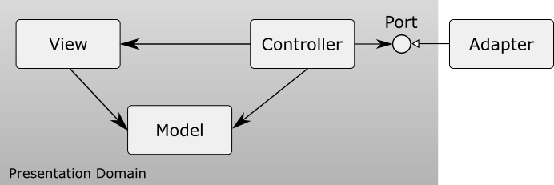

## Overview

WPF MVC is a class library for Windows Presentation Foundation with Model View Controller architecture.



In WPF MVC, the roles of a model, view, and controller are redefined as follows.

### Model

The model represents an object model in the presentation domain.
It has its properties, its internal states, events that occur when its internal states are changed, that are usually normal .NET events, and so on,
but does not have any business logic.
It is similar to Presentation Model, but unlike to Presentation Model, it does not have main presentaion logic.
It has only behaviors for internal states that is encapsulated.
It has also references to other models and sends messages to each other.

### View

The view represents an appearance of the model. It is defined with a DataTemplate.
As it knows a model associated with it, values of its properties are set by binding values of the model.

### Controller

The controller handles routed events that occur on the view by using the model associated with the view.
It has a reference to the business domain and sends a message to it to execute business logic.
Its reference to the business domain is usually injected by DI container.

The basic flow is as follows;

1. An event occurs on the view or on other domain.
1. The controller receives it and sends an appropriate message to the model.
1. The model updates its internal states.
1. The view receives the change of the model and updates its appearance.

## Features

This library provides a feature to specify a controller to handle events that occur on the view using the ViewAttribute.

``` csharp
[View]
class Controller {...}
```

The view to which the controller is attached is specified using the following properties.

- ViewType

  The type of the view to which the controller is attached is specified.

- Key

  The key of the view to which the controller is attached is specified. The name of the data context type can also be specified as the key.

The condition to search the controller is as follows:

1. whether the value of the ViewType is equal to the type of the view if the ViewType is specified. If the ViewType is not specified, the controller is the target.
1. whether the value of the Key is equal to the key of the view if the Key is specified. If the Key is not specified, the controller is the target. If the key of the view is not specified, search whether the Key is equal to:

   1. the name of the data context type.
   1. the full name of the data context type.
   1. the full name of the data context type without parameters if its type is generics.
   1. the name of the base type of the data context.
   1. the name of the interface that is implemented by the data context.

A controller can be created with a factory that implements IWpfControllerFactory. If a factory is not specified, a default factory that creates a controller with Activator.CreateInstance method is used.

``` csharp
class ControllerFactory : IWpfControllerFactory {...}
```

``` csharp
WpfController.ControllerFactory = new ControllerFactory();
```

This library provides a feature to specify a controller with an attached property to the target element.

``` xml
<Grid xmlns:w="using:Charites.Windows.Mvc"
      w:WpfController.IsEnabled="True">
</Grid>
```

If the key of the view should be specified, then the Key attached property can be used. In this case, the IsEnabled attached property is automatically set to true.
``` xml
<Grid xmlns:w="using:Charites.Windows.Mvc"
      w:WpfController.Key="...">
</Grid>
```

This library also provides features to inject routed event handlers, command event handlers, a data context, and visual elements to the controller using attributes.
The available attributes are as follows.

### EventHandlerAttribute

This attribute is specified to the method to handle a routed event.
It is also specified to the property or the field that is defined with a delegate.
The method is declared as follows;

- No argument.

``` csharp
[EventHandler(ElementName = "ActionButton", Event = "Click")]
private void ActionButton_Click()
{
    // implements the action.
}
```

- One argument that is a RoutedEventArgs.

``` csharp
[EventHandler(ElementName = "ActionButton", Event = "Click")]
private void ActionButton_Click(RoutedEventArgs e)
{
    // implements the action.
}
```

- Two arguments that are an object and a RoutedEventArgs.

``` csharp
[EventHandler(ElementName = "ActionButton", Event = "Click")]
private void ActionButton_Click(object? sender, RoutedEventArgs e)
{
    // implements the action.
}
```

If the method name is "[ElementName]_[EventName]", this attribute does not have to be specified.
``` csharp
private void ActionButton_Click()
{
    // implements the action.
}

private void ActionButton_Click(RoutedEventArgs e)
{
    // implements the action.
}

private void ActionButton_Click(object? sender, RoutedEventArgs e)
{
    // implements the action.
}
```

If the method is an async method, its suffix can be "Async".

``` csharp
private async Task ActionButton_ClickAsync()
{
    // implements the action.
}

private async Task ActionButton_ClickAsync(RoutedEventArgs e)
{
    // implements the action.
}

private async Task ActionButton_ClickAsync(object? sender, RoutedEventArgs e)
{
    // implements the action.
}
```

### CommandHandlerAttribute

This attribute is specified to the method to handle a command event.
It is also specified to the property or the field that is defined with a delegate.
The method is declared as follows;

- No argument.

``` csharp
[CommandHandler(CommandName = "ActionCommand", Event = "Executed")]
private void ActionCommand_Executed()
{
    // implements the action of the command Executed event.
}

[CommandHandler(CommandName = "ActionCommand", Event = "PreviewExecuted")]
private void ActionCommand_PreviewExecuted()
{
    // implements the action of the command PreviewExecuted event.
}
```

- One argument that is a ExecutedRoutedEventArgs / CanExecuteRoutedEventArgs.

``` csharp
[CommandHandler(CommandName = "ActionCommand", Event = "Executed")]
private void ActionCommand_Executed(ExecutedRoutedEVentArgs e)
{
    // implements the action of the command Executed event.
}

[CommandHandler(CommandName = "ActionCommand", Event = "CanExecute")]
private void ActionCommand_CanExecute(CanExecuteRoutedEventArgs e)
{
    // implements the action of the command CanExecute event.
}

[CommandHandler(CommandName = "ActionCommand", Event = "PreviewExecuted")]
private void ActionCommand_PreviewExecuted(ExecutedRoutedEVentArgs e)
{
    // implements the action of the command EPreviewxecuted event.
}

[CommandHandler(CommandName = "ActionCommand", Event = "PreviewCanExecute")]
private void ActionCommand_PreviewCanExecute(CanExecuteRoutedEventArgs e)
{
    // implements the action of the command PreviewCanExecute event.
}
```

- Two arguments that are an object and a ExecutedRoutedEventArgs / CanExecuteRoutedEventArgs

``` csharp
[CommandHandler(CommandName = "ActionCommand", Event = "Executed")]
private void ActionCommand_Executed(object? sender, ExecutedRoutedEVentArgs e)
{
    // implements the action of the command Executed event.
}
[CommandHandler(CommandName = "ActionCommand", Event = "CanExecute")]
private void ActionCommand_CanExecute(object? sender, CanExecuteRoutedEventArgs e)
{
    // implements the action of the command CanExecute event.
}

[CommandHandler(CommandName = "ActionCommand", Event = "PreviewExecuted")]
private void ActionCommand_PreviewExecuted(object? sender, ExecutedRoutedEVentArgs e)
{
    // implements the action of the command PreviewExecuted event.
}
[CommandHandler(CommandName = "ActionCommand", Event = "PreviewCanExecute")]
private void ActionCommand_PreviewCanExecute(object? sender, CanExecuteRoutedEventArgs e)
{
    // implements the action of the command PreviewCanExecute event.
}
```

If the method name is "[ElementName]_Executed", "[ElementName]_CanExecute", "[ElementName]_PreviewExecuted", or "[ElementName]_PreviewCanExecute", this attribute does not have to be specified.

``` csharp
private void ActionCommand_Executed()
{
    // implements the action of the command Executed event.
}

private void ActionCommand_PreviewExecuted()
{
    // implements the action of the command PreviewExecuted event.
}

private void ActionCommand_Executed(ExecutedRoutedEventArgs e)
{
    // implements the action of the command Executed event.
}

private void ActionCommand_CanExecute(CanExecuteRoutedEventArgs e)
{
    // implements the action of the command CanExecute event.
}

private void ActionCommand_PreviewExecuted(ExecutedRoutedEventArgs e)
{
    // implements the action of the command PreviewExecuted event.
}

private void ActionCommand_PreviewCanExecute(CanExecuteRoutedEventArgs e)
{
    // implements the action of the command PreviewCanExecute event.
}

private void ActionCommand_Executed(object? sender, ExecutedRoutedEventArgs e)
{
    // implements the action of the command Executed event.
}

private void ActionCommand_CanExecute(object? sender, CanExecuteRoutedEventArgs e)
{
    // implements the action of the command CanExecute event.
}

private void ActionCommand_PreviewExecuted(object? sender, ExecutedRoutedEventArgs e)
{
    // implements the action of the command PreviewExecuted event.
}

private void ActionCommand_PreviewCanExecute(object? sender, CanExecuteRoutedEventArgs e)
{
    // implements the action of the command PreviewCanExecute event.
}
```

If the method is an async method, its suffix can be "Async".

``` csharp
private async Task ActionCommand_ExecutedAsync()
{
    // implements the action of the command Executed event.
}

private async Task ActionCommand_PreviewExecutedAsync()
{
    // implements the action of the command PreviewExecuted action.
}

private async Task ActionCommand_ExecutedAsync(ExecutedRoutedEventArgs e)
{
    // implements the action of the command Executed event.
}

private async Task ActionCommand_CanExecuteAsync(CanExecuteRoutedEventArgs e)
{
    // implements the action of the command CanExecute event.
}

private async Task ActionCommand_PreviewExecutedAsync(ExecutedRoutedEventArgs e)
{
    // implements the action of the command PreviewExecuted event.
}

private async Task ActionCommand_PreviewCanExecuteAsync(CanExecuteRoutedEventArgs e)
{
    // implements the action of the command PreviewCanExecute event.
}

private async Task ActionCommand_ExecutedAsync(object? sender, ExecutedRoutedEventArgs e)
{
    // implements the action of the command Executed event.
}

private async Task ActionCommand_CanExecuteAsync(object? sender, CanExecuteRoutedEventArgs e)
{
    // implements the action of the command CanExecute event.
}

private async Task ActionCommand_PreviewExecutedAsync(object? sender, ExecutedRoutedEventArgs e)
{
    // implements the action of the command PreviewExecuted event.
}

private async Task ActionCommand_PreviewCanExecuteAsync(object? sender, CanExecuteRoutedEventArgs e)
{
    // implements the action of the command PreviewCanExecute event.
}
```

### FromDIAttribute

This attribute is specified to the parameter. Its parameter value is injected using the dependency injection.

``` csharp
private void ActionButton_Click([FromDI] IDataLoader dataLoader)
{
    // implements the action.
}

private void ActionButton_Click(RoutedEventArgs e, [FromDI] IDataLoader dataLoader)
{
    // implements the action.
}

private void ActionButton_Click(object? sender, RoutedEventArgs e, [FromDI] IDataLoader dataLoader)
{
    // implements the action.
}

private void ActionCommand_Executed([FromDI] IDataLoader dataLoader)
{
    // implements the action.
}

private void ActionCommand_Executed(ExecutedRoutedEventArgs e, [FromDI] IDataLoader dataLoader)
{
    // implements the action.
}

private void ActionCommand_Executed(object? sender, ExecutedRoutedEventArgs e, [FromDI] IDataLoader dataLoader)
{
    // implements the action.
}
```

### DataContextAttribute

This attribute is specified to the field, property, or method to which a DataContext is injected.
The method has an argument the type of which is the one of a DataContext.
The implementation is as follows;

- Field

``` csharp
[DataContext]
private DataContexType? dataContext;
```

- Property

``` csharp
[DataContext]
public DataContexType? DataContext { get; set; }
```

- Method

``` csharp
[DataContext]
public void SetDataContext(DataContexType? dataContext)
{
    this.dataContext = dataContext;
}
private DataContexType? dataContext;
```

If the method name is "SetDataContext", this attribute does not have to be specified.
``` csharp
private void SetDataContext(DataContextType? dataContext)
{
    this.dataContext = dataContext;
}
private DatacontextType? dataContext;
```

### ElementAttribute

This attribute is specified to the field, property, or method to which an element is injected.
The method has an argument the type of which is the one of an element.
The element the name of which is equal to the one of field, property, or method is injected.
When the name of the method starts with "Set", the target name of the method is the value removed "Set" from the method name.
If the name of the element is different from the one of the field, property, or method,
the name of the element is specified to the Name property of the ElementAttribute.
The implementation to inject an element the name of which is "Element" is as follows;

- Field

``` csharp
[Element(Name = "Element")]
private UIElement? element;
```

- Property

``` csharp
[Element]
public UIElement? Element { get; set; }
```

- Method

``` csharp
[Element]
public void SetElement(UIElement? element)
{
    this.element = element;
}
private UIElement? element;
```

## NuGet

[WpfMvc](https://www.nuget.org/packages/WpfMvc/)

## LICENSE

This software is released under the MIT License, see LICENSE.